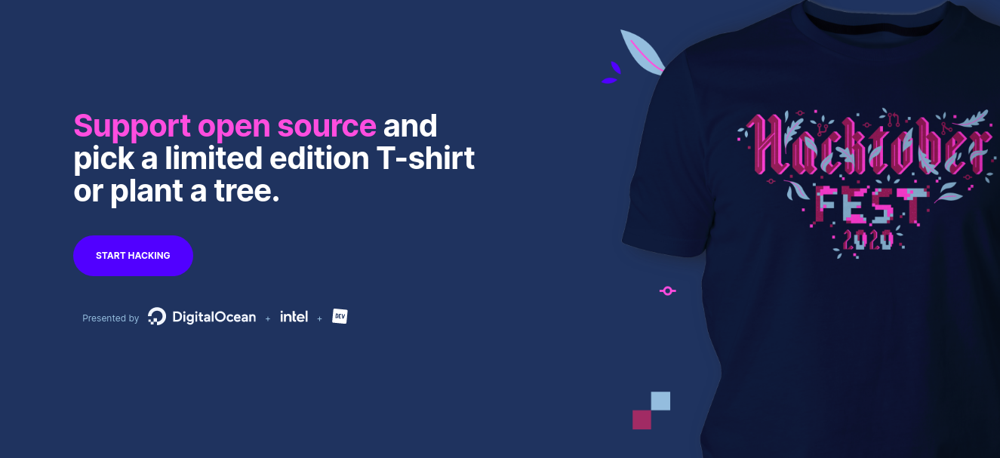

# HacktoberFest 2020 👋 is Here..!

## Ideas-and-applications 💡
This is repo is made for the purpose of adding ideas using technology and making application to make life easier, the project can be simpler as text-lenght counter to any big application.

# [Contributing.md](CONTRIBUTING.md)

## Getting started

* Please ensure that your pull request adheres to the following guidelines:

* add your ideas and application by adding myInfo.md that consists of name and github profile and your ideas + small application(any).
* Search previous suggestions before making a new one, as yours may be a duplicate.
* Make sure your contribution is useful and relevant before submitting. That implies it has enough content and every item has a good succinct description.
* Make an individual pull request for each suggestion.
Use the following format: - [Repository Name](link-to-repository-label) _(label: Ideas-and-applications-in-the-repository)_   Description
Example link formatting: - [Ideas-and-application](https://github.com/oshyam/Ideas-and-applications/labels/Ideas-and-application) _(label: good-first-contribution)_   A list of awesome beginners-friendly projects.
Link additions should be added to the bottom of the relevant category.
New categories or improvements to the existing categorization are welcome.
* Check your spelling and grammar.
Make sure your text editor is set to remove trailing whitespace.
* The pull request and commit should be given a meaningful title.
* Ensure that you describe your pull request.
* The contributed repository must be maintained, have an active community to be able to help newcomers and have issues with an appropriate label.
* Links must be pointing directly to the repository, no tracking links allowed. This list is not for advertising purposes.
Thank you for your suggestions!
